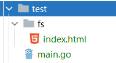
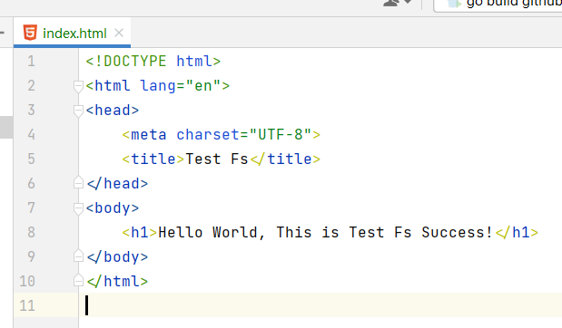
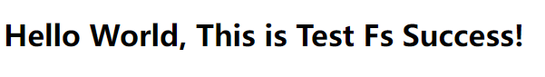

# go-html
A static proxy technology, combined with the Gin framework

## 1. install
     go get github.com/gounits/gohtml

## 2. usage



```go
package main

import (
	"embed"
	"github.com/gin-gonic/gin"
	"github.com/gounits/gohtml"
)

//go:embed fs
var efs embed.FS

func main() {
	r := gin.Default()
	r.Use(gohtml.NewFs(efs))
	//r.Use(gohtml.New("fs"))
	if err := r.Run(":8080"); err != nil {
		panic(err)
	}
}

```


## 3.Web
    click http://localhost:8080/


